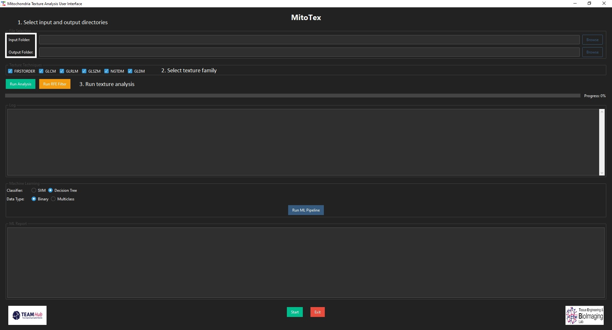
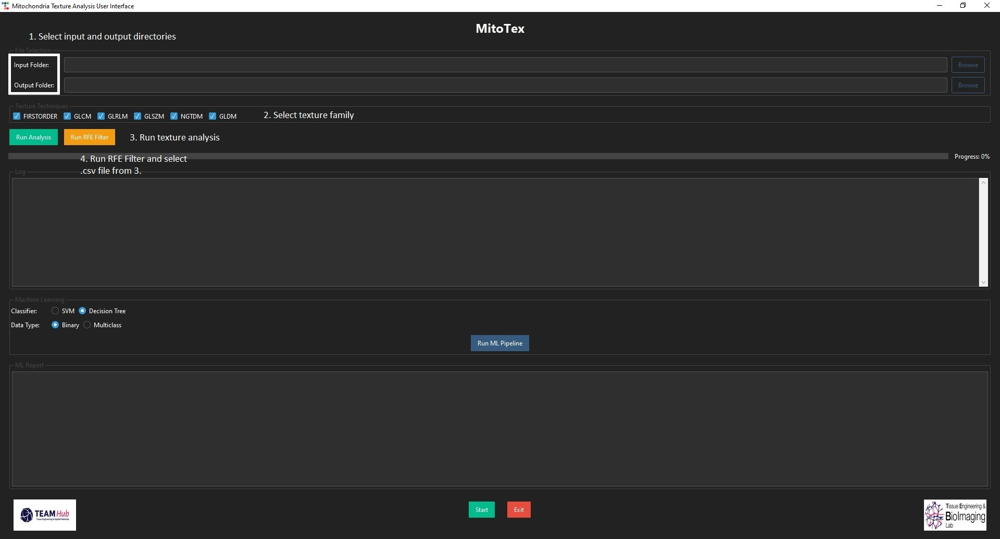
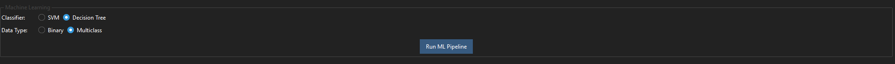
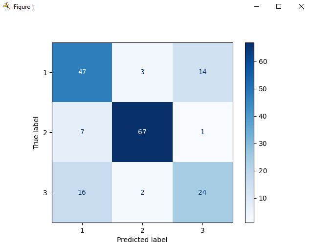
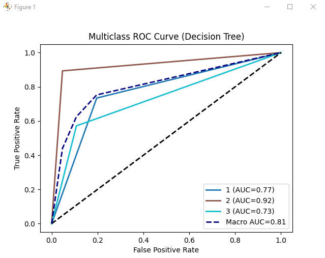

# Characterization and Classification of Mitochondrial Structures

This project uses texture-based image analysis and machine learning to extract quantitative features and classify mitochondrial structures (rods, puncta, fibers) from microscopy images. It includes scripts for feature extraction (using the pyRadiomics), feature selection, and machine learning-based classification using python.

------------------------------------------------------------------------

## ⚙️ Requirements

-   Python 3.9+
-   Python packages:
    -   numpy\>=1.9.2
    -   pandas
    -   SimpleITK
    -   Pillow
    -   radiomics
    -   scikit-learn
    -   scikit-image
    -   matplotlib
    -   xlsxwriter
    -   tk
    -   ttkbootstrap

### Troubleshooting old python3.9-tkinter
``` bash
apt-get install software-properties-common
add-apt-repository ppa:deadsnakes/ppa
apt-get update
apt-get install python3.9
apt-get install python3.9-venv
apt-get install python3.9-dev

# Install all module except pyradiomics
grep -v pyradiomics requirements.txt | pip install -r /dev/stdin
# The pyradiomics package includes C extensions (radiomics._cmatrices) that need to be compiled. To compile C code that interfaces with Python, you need:
pip install numpy==1.25.1 Cython
pip install --no-build-isolation pyradiomics==3.0.1
```
### Troubleshooting old python3.9-tkinter
``` bash
sudo apt-get install python3.9-tk
```
### Install dependencies with:

``` bash
pip install -r requirements.txt
```

## 🏁 Getting Started

This tool is designed for researchers interested in quantitative microscopy analysis — no advanced programming skills required.
Basic familiarity with running Python scripts will help, but the Graphical User Interface (GUI) makes it accessible to users of all levels.

### 1. Set up your Python environment
* We recommend using [Anaconda](https://www.anaconda.com/) to manage Python and the dependencies
* Once installed, create and activate a new environment:

``` bash
conda create -n mito_env python=3.9
conda activate mito_env
pip install -r requirements.txt
```
**Tip:** Youn can also use ``` venv ``` or ``` pipenv ``` if you prefer a lightweight setup.

### 2. Preparing your images
* Pre-process your images as necessary (i.e., denoising, background corrections, etc)
* Save images as ```.tiff ``` format


### 3.  Launch the Graphical User Interface (GUI)
* From your command line or terminal, navigate to the folder containing the main script and run:

``` bash
python Mito_feature_extraction_gui.py
```
Once opened, follow the GUI prompts to extract features, perform feature selection, and classify mitochondrial morphologies.
### Feature extraction
1. Select **input** and **output** directories.
2. Choose the texture feature group(s): 
    - FOS, GLCM, GLRLM, GLDM, GLSZM, NGTDM
3. The GUI will save the results as both ```.csv``` and ```.xlsx``` files in your selected output directory.

### Recursive Feature Elimination (RFE)
1. Select your labelled ```.csv``` file
2. Choose an **output directory** for the results
3. The RFE process will automatically select the top 20 most informative features

### 4.  Machine Learning Classification
1. Select the classification model
    * Decision Tree 
    * Support Vector Machine (SVM) 
2. Choose the classification type 
    * Binary
    * Multiclass
3. Provide the RFE-selected feature set as the input
4. The pipeline will generate
    * Confusion matrix
    * ROC curve
    * Classification report (accuracy, precision, recall, F1-score)

**Tip:** Results are automatically saved in the selected output directory.

------------------------------------------------------------------------
## Example usage

### 1. Setting up texture analysis 

1. Select input folder containing ```.tiff``` files (example images are located in ```src\test_dataset\images```) and output folder for analysis results
2. Select specific texture for analysis.
3. Run analysis



### 2. RFE feature selection

1. Select Run RFE filter
2. Select ```.csv``` file from part 1



### 3. Classification
1. Select classifier type
2. select data type
3. Select input ```.csv``` file



**Example output**
1. Confusion matrix


2. AUC-ROC curve

3. Classification report

**Decision Tree Classification**

**CV Accuracy:** 0.79 ± 0.03  
**Test Accuracy:** 0.76  

| Class | Precision | Recall | F1-score | Support |
|-------|-----------|--------|----------|--------|
| 1     | 0.67      | 0.73   | 0.70     | 64     |
| 2     | 0.93      | 0.89   | 0.91     | 75     |
| 3     | 0.62      | 0.57   | 0.59     | 42     |
| **Accuracy**  | -         | -      | 0.76     | 181    |
| **Macro Avg** | 0.74      | 0.73   | 0.74     | 181    |
| **Weighted Avg** | 0.77  | 0.76   | 0.76     | 181    |


## Features extracted with texture analysis

The feature extraction methods used were implemented in the paper:

The texture features used are based on the framework from:
Joost J. M. van Griethuysen et al. (2017). “Computational Radiomics System to Decode the Radiographic Phenotype.” Cancer Research, 77(21): e104–e107.

These features represent gray-level–based textural families and first-order statistics (FOS), providing insight into pixel intensity distributions and spatial relationships.


## Summary of Texture Families

### First Order Statistics (FOS)

Measures intensity-based features without spatial context (e.g., mean, skewness, kurtosis, standard deviation) [1,2]. 

### Gray Level Co-Occurrence Matrix (GLCM)

Quantifies how often pairs of pixel intensities occur together, revealing spatial organization and directionality [3,4]. 

### Gray Level Run Length Matrix (GLRLM)

Analyzes consecutive pixels with the same intensity along a line, offering insights into fragmentation [5]. 

### Gray Level Dependence Matrix (GLDM)

Measures the number of neighboring pixels within a set distance that depend on a central pixel, capturing uniformity and organization [6]. 

### Gray Level Size Zone Matrix (GLSZM)

Assesses zone sizes (connected pixel regions with equal intensity) to quantify texture complexity [7]. 

### Neighbouring Gray Tone Difference Matrix (NGTDM)

Compares each pixel’s intensity to its neighborhood average, identifying fine textural variations and coarseness [8]. 

---
## References
[1] Nidhi Aggarwal and Rajendra Kumar Agrawal. First and second order statistics features for classification of magnetic resonance brain images. Journal of Signal Processing Systems, 3:146–153, 2012.

[2] M. Bevk and I. Kononenko. A statistical approach to texture description of medical images: a preliminary study. In Proceedings of 15th IEEE Symposium on Computer-Based Medical Systems (CBMS 2002), pages 239–244, 2002.

[3] Robert M. Haralick, K. Shanmugam, and Its’Hak Dinstein. Textural featuresfor image classification. IEEE Transactions on Systems, Man, and Cybernetics, SMC-3(6):610–621, 1973.

[4] Tommy L ̈ofstedt, Patrik Brynolfsson, Thomas Asklund, Tufve Nyholm, and Anders Garpebring. Gray-level invariant haralick texture features. PLoS One, 14(2):e0212110, February 2019.

[5] Mary M. Galloway. Texture analysis using gray level run lengths. Computer Graphics and Image Processing, 4(2):172–179, 1975.

[6] Chengjun Sun and William G Wee. Neighboring gray level dependence matrix for texture classification. Computer Vision, Graphics, and Image Processing, 23(3):341–352, 1983.

[7] Guillaume Thibault, Jesus Angulo, and Fernand Meyer. Advanced statistical matrices for texture characterization: Application to cell classification. IEEE Transactions on Biomedical Engineering, 61(3):630–637, 2014.

[8] M. Amadasun and R. King. Textural features corresponding to textural properties. IEEE Transactions on Systems, Man, and Cybernetics, 19(5):1264–1274, 1989.

---

## Acknowledgements

-   Developed as part of Amulya Kaianathbhatta’s M.A.Sc. thesis at Carleton University.
DOI: https://doi.org/10.22215/etd/2024-16247

-   Supervised by Dr. Leila Mostaço-Guidolin, Tissue Engineering and BioImaging Lab (www.teb-lab.com), Tissue Engineering and Applied Materials (TEAM) Hub (www.teamhubottawa.com)
-   Texture feature extraction:  [PyRadiomics](https://pyradiomics.readthedocs.io/en/latest/)
-   Feature selection and machine learning pipeline: implemented by Natasha Kunchur.

## Citing this work 

If you use this repository, data, or code in your research, please acknowledge it as follows: 

“Analysis tools and computational workflows were developed at the Tissue Engineering and BioImaging Lab (TEB) and TEAM Hub, Carleton University (RRID:SCR_022968).”

